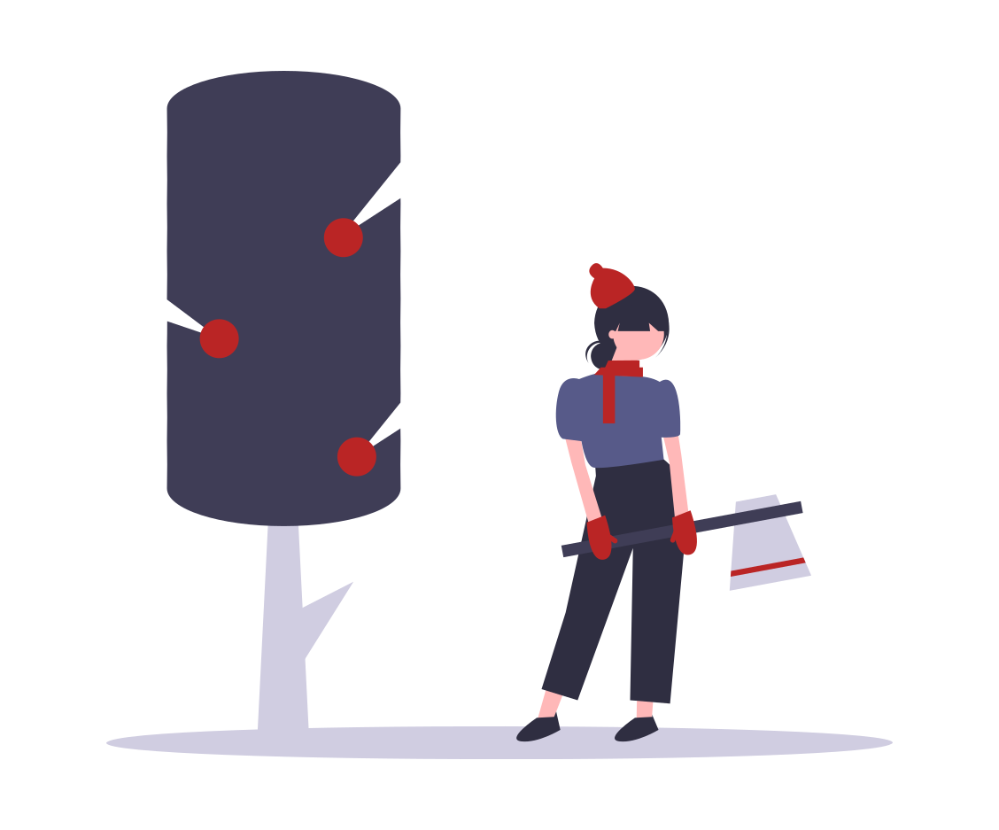
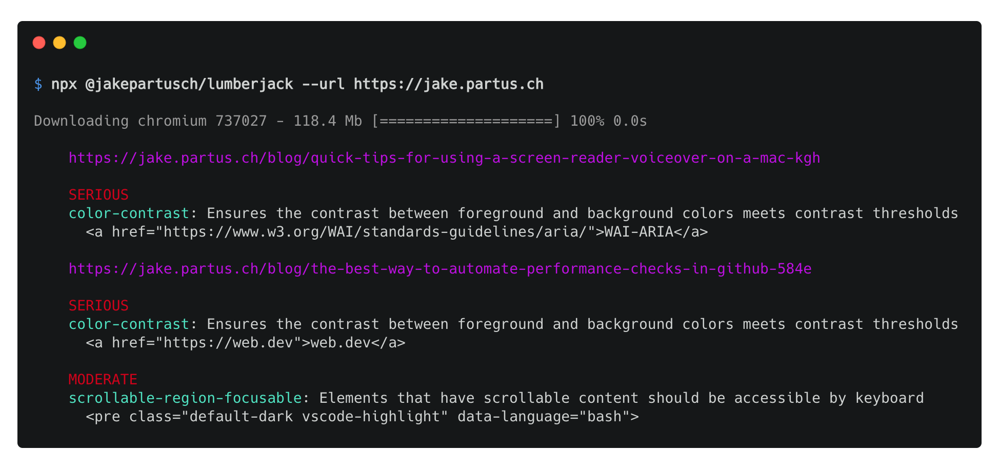

<h1 align="center">
  Lumberjack
</h1>

<p align="center">
  Chop down accessibility issues with this full-website accessibility scanner
</p>

<p align="center">
  
</p>

# About

Lumberjack runs [axe](https://www.deque.com/axe/) accessibility checks on your entire website!

- Reads your website's sitemap
- Spawns multiple browser instances and starts scanning with axe
- Aggregates results and reports back
  <p>
    
  </p>

# Usage

## CLI

NPX (recommended for a single run)

```
npx @jakepartusch/lumberjack --url https://google.com
```

Global Install (recommended for multiple runs)

```
npm install -g @jakepartusch/lumberjack
lumberjack --url https://google.com
```

## JavaScript

```
npm install @jakepartusch/lumberjack
```

```
const lumberjack = require('@jakepartusch/lumberjack');

const myFunction = async () => {
  const results = await lumberjack("https://google.com")
  console.log(results);
}
```

## Continuous Integration

GitHub Actions Example
(eg. ".github/workflows/accessibility.yml")

```
name: Accessibility Audits

on: [push]

jobs:
  build:
    runs-on: ubuntu-18.04

    steps:
      - uses: actions/checkout@v1
      - name: Install required Linux packages
        run: |
          sudo apt-get update
          sudo apt-get install libgbm-dev
          sudo apt-get install xvfb
      - name: Use Node.js 12.x
        uses: actions/setup-node@v1
        with:
          node-version: 12.x
      - name: Install npm packages
        run: |
          npm ci
      - name: Build
        run: |
          npm run build
      - name: Accessibility Audits
        run: |
          npm install -g @jakepartusch/lumberjack
          xvfb-run --auto-servernum lumberjack --url https://google.com

```
