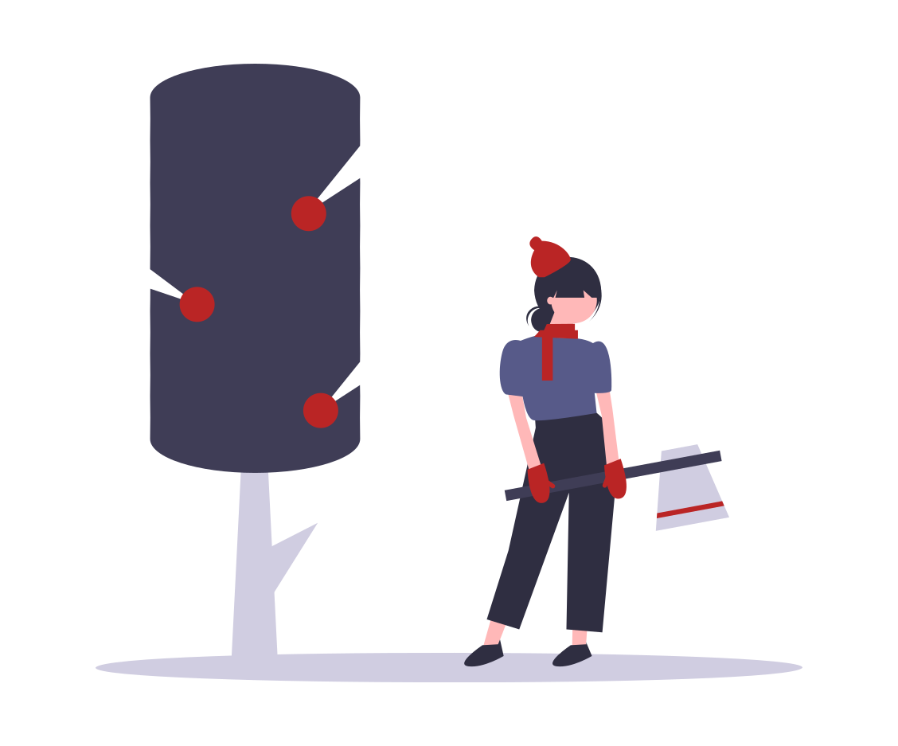

<h1 align="center">
  Lumberjack
</h1>

<p align="center">
  Chop down accessibility issues with this full-website accessibility scanner
</p>

<p align="center">
  

</p>

# About

Lumberjack runs [axe](https://www.deque.com/axe/) accessibility checks on your entire website!

- Reads your website's sitemap
- Spawns multiple browser instances and starts scanning with axe
- Aggregates results and reports back

# Usage

## CLI

NPX (recommended for a single run)

```
npx @jakepartusch/lumberjack --url https://google.com
```

Global Install (recommended for multiple runs)

```
npm install -g @jakepartusch/lumberjack
lumberjack --url https://google.com
```

## JavaScript (Node.js)

```
npm install @jakepartusch/lumberjack
```

```
const lumberjack = require('@jakepartusch/lumberjack');

const myFunction = async () => {
  const results = await lumberjack("https://google.com")
  console.log(results);
}
```
